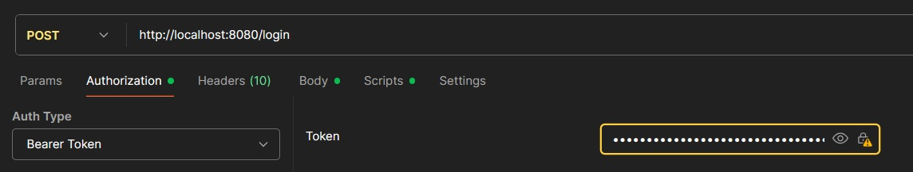

# API de Cadastro de Clientes

## 🎯 Objetivo
Este projeto consiste em uma API RESTful, desenvolvida como um **MVP (Minimum Viable Product)** para o cadastro de clientes pessoa física.  
A solução foi desenvolvida em **Java com Spring Boot** e implementa um CRUD completo com paginação e busca, segurança baseada em token **JWT**, testes unitários e de integração, e empacotamento com **Docker**, seguindo as melhores práticas do desenvolvimento de software moderno.

---

## 🛠️ Tecnologias Utilizadas
- Java 21
- Spring Boot 3
- Spring Web
- Spring Data JPA
- Spring Security
- Maven
- PostgreSQL
- Docker & Docker Compose
- JUnit 5 & Mockito
- JSON Web Tokens (JWT)
- Lombok
- Swagger / OpenAPI 3
- Padrão DTO
- Arquitetura em Camadas
- Specification-arg-resolver

---

## 📂 Estrutura do Projeto
- **controller**: Camada de apresentação (endpoints REST).
- **service**: Regras de negócio (ex: cálculo de idade, validação de CPF duplicado).
- **repository**: Comunicação com o banco via Spring Data JPA.
- **model**: Entidades JPA (Cliente, Usuario).
- **dto**: Objetos de transferência de dados (contratos da API).
- **security**: Implementação de autenticação e autorização (Spring Security + JWT).

---
## 💡 Decisões de Projeto e Processo Criativo
Esta seção descreve as principais decisões de arquitetura e tecnologia tomadas durante o desenvolvimento da API.

### 1. Arquitetura em Camadas
Desde o início, optei por uma arquitetura em camadas (Controller, Service, Repository). Essa decisão foi fundamental para garantir a separação de responsabilidades, o que torna o código mais limpo, fácil de manter e, crucialmente, mais testável. A camada de Service concentra toda a lógica de negócio, deixando os Controllers apenas com a responsabilidade de gerenciar as requisições HTTP.

### 2. Escolha do Banco de Dados
O desafio permitia flexibilidade na escolha do banco de dados. Durante o desenvolvimento inicial, enfrentei alguns desafios de configuração de ambiente com o Docker e o PostgreSQL. Para não travar o progresso e poder focar na construção da lógica da API, tomei a decisão pragmática de utilizar o banco de dados em memória H2. Isso me permitiu desenvolver e testar rapidamente o CRUD e as regras de negócio.
Uma vez que a aplicação estava funcional, migrei a configuração para o PostgreSQL, um sistema de banco de dados mais robusto e alinhado com ambientes de produção. Essa abordagem em duas etapas demonstra a capacidade de adaptar as ferramentas ao estágio do projeto, priorizando a agilidade no início e a robustez no final.

### 3. Segurança com JWT (Stateless)
Para a segurança da API, a escolha foi por uma abordagem stateless utilizando JSON Web Tokens (JWT). Em vez de sessões tradicionais, que consomem memória no servidor, o JWT permite que cada requisição seja autossuficiente. Essa arquitetura é mais escalável e é o padrão de mercado para APIs REST modernas. A implementação foi feita com o Spring Security, configurando um filtro (SecurityFilter) que valida o token a cada requisição, garantindo que os endpoints fiquem protegidos.

### 4. Contrato da API com DTOs
Decidi usar o padrão Data Transfer Object (DTO) para todas as entradas e saídas da API. Isso desacopla a representação externa (o JSON que o cliente vê) da representação interna (as entidades JPA). Essa prática traz enormes benefícios, como:
- Segurança: Evita a exposição acidental de campos sensíveis da entidade.
- Flexibilidade: Permite moldar o JSON da resposta para atender exatamente ao que o cliente precisa, como no caso do cálculo da idade, que não existe como uma coluna no banco.
- Validação: Mantém as validações de entrada (@Valid) na camada da API, onde elas pertencem.

### 5. Testabilidade
Acredito que código não testado é código quebrado. Por isso, a criação de testes foi uma prioridade. Adotei uma estratégia de testes em duas frentes:
Testes Unitários para a camada de Service, usando Mockito para isolar a lógica de negócio e garantir que as regras (como a validação de CPF duplicado) funcionam corretamente, sem a necessidade de um banco de dados.
Testes de Integração para a camada de Controller, usando MockMvc e @SpringBootTest. Esses testes validam o fluxo completo, desde a requisição HTTP até a resposta, garantindo que a segurança, a validação e a persistência estão funcionando em conjunto. A anotação @Transactional foi utilizada para garantir que os testes não deixem "lixo" no banco de dados.

### 6. Dockerização
Finalmente, optei por "dockerizar" toda a aplicação com um Dockerfile multi-estágio e um docker-compose.yml. A decisão de ir além e fazer isso foi para entregar não apenas um código, mas um ambiente de execução completo, portátil e consistente. Isso facilita imensamente a vida de quem vai avaliar o projeto, eliminando qualquer problema de "na minha máquina funciona" e demonstrando familiaridade com práticas de DevOps essenciais no mercado atual.

---

## ✅ Checklist de Requisitos

### 📘 Requisitos Funcionais
- [✅] Inclusão de novos clientes (POST `/clientes`)
- [✅] Atualização de clientes existentes (PUT `/clientes/{id}`)
- [✅] Exclusão de clientes existentes (DELETE `/clientes/{id}`)
- [✅] Listagem paginada de clientes (GET `/clientes?page=0&size=10`)
- [✅] Busca dinâmica por atributos (GET `/clientes/buscar?nome=Maria&cpf=11122233344`)

### ⚖️ Regras de Negócio e Técnicos
- [✅] Idade calculada dinamicamente a partir da data de nascimento
- [✅] Validação de dados de entrada (Bean Validation)
- [✅] Unicidade de CPF
- [✅] Documentação com Swagger/OpenAPI
- [✅] Segurança com JWT (stateless)
- [✅] Abstração de dados com Spring Data JPA

---

## 🧪 Cobertura de Testes
- [✅] **Testes Unitários**: ClienteService (cálculo de idade, validação de CPF duplicado).
- [✅] **Testes de Integração**: ClienteController (MockMvc, fluxo de endpoints, segurança).

---

## 🚀 Bônus
- [✅] Empacotamento com Docker (Dockerfile multi-stage + Docker Compose).

---

## 🚀 Como Executar o Projeto (Docker)

### Pré-requisitos
- Git
- Docker Desktop (ou Docker Engine + Compose)

### Passos
```bash
# Clonar o repositório
git clone https://github.com/Goguel/Cliente-API
cd Cliente-API

# Criar arquivo .env com a variável secreta
echo "API_SECRET=minha-chave-secreta-super-dificil" > .env

# Subir os containers (API + DB)
docker-compose up --build
```
A aplicação iniciará e estará disponível em `http://localhost:8080`.

## 🧪 Como Executar os Testes

Para rodar a suíte de testes unitários e garantir a integridade das regras de negócio, execute o seguinte comando na raiz do projeto:

```bash
./mvnw test
```

## 📚 Documentação da API (Swagger)

Com a aplicação em execução, a documentação interativa da API, gerada pelo Swagger UI, pode ser acessada no seguinte endereço:

➡️ **[http://localhost:8080/swagger-ui.html](http://localhost:8080/swagger-ui.html)**

A interface do Swagger permite visualizar todos os endpoints, seus parâmetros, DTOs de entrada e saída, e testar a API diretamente pelo navegador.

## 💻 Utilizando a API (com Postman/Insomnia)

### 1. Obter o Token de Autenticação 🔑

A API utiliza autenticação via JWT. O primeiro passo é obter um token de acesso.

* **Endpoint:** `POST /login`
* **Body (raw/JSON):**
    ```json
    {
      "login": "admin",
      "senha": "123456"
    }
    ```
* **Resposta:** A API retornará um JSON com o token de acesso. Copie o valor do campo `token`.
    ```json
    {
      "token": "eyJhbGciOiJIUzI1NiJ9..."
    }
    ```

### 2. Fazer Requisições Autenticadas

Para todos os outros endpoints, você deve incluir o token no cabeçalho da requisição.

* **Tipo de Autorização:** `Bearer Token`
* **Header:** `Authorization: Bearer <seu_token_copiado_aqui>`

A imagem abaixo mostra onde deve-se colocar o tipo de autorização(Auth Type) e o token gerado no Postman.
Com o token e o Auth Type corretos, pode-se fazer todas as outras requisições normalmente.




## 🗄️ Acesso ao Banco de Dados PostgreSQL (pgAdmin)

Com a aplicação rodando, é possível acessar o console web do banco de dados para inspecionar os dados.

* **Configurações de Login:**
    * **Host:** `localhost`
    * **Database:** `cliente-api-db`
    * **Username:** `user-api`
    * **Password:**  `password-api`


Clique em "Connect" para acessar o banco.